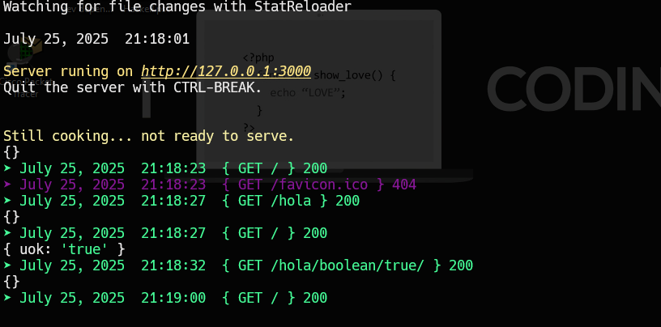

# Asimilation

**Asimilation** is a personal backend framework where I bring together all my backend knowledge.  
It’s inspired by frameworks from the Python ecosystem (like **Django** and **Flask**) and adapts their concepts to **Node.js**.

Although it began in JavaScript, the project has been fully **migrated to TypeScript** for better maintainability and type safety.  
Its structure and design don’t always follow conventional JS patterns — they’re heavily influenced by **Pythonic backend philosophies**.

---

##  Why I Built This

Asimilation is also the project where I began my **TypeScript journey**.

At first, I wrote it in JavaScript, but I quickly realized that I don't enjoy writing untyped code.  
Without types, I had to write more validations, handle more edge cases manually, and rely too much on control structures.  
It became obvious that using a typed language would help me write cleaner, safer, and more scalable code.

That’s when I decided to migrate everything to TypeScript — and use this project as my learning ground.

I also have another personal project written in **Tkinter (Python)**, which I want to migrate to **Electron**. So, learning TypeScript now gives me a solid foundation for that transition, and helps me get closer to learning **React** as well.


---

> **Status:**  This project is under active development and may not work properly yet. Expect bugs and incomplete features.

---

##  Features

- ✅ **Custom Routing System** — Inspired by Django, with a `Paths` class to manage URL patterns and views.
- ✅ **Native HTTP Server** — Built on Node.js’s `http` module for full control and educational value.
- ✅ **Status Logging** — Color-coded HTTP status codes for easier debugging.
- ✅ **Middleware System** — Supports chained middleware functions like in Express.
- ✅ **Modular Structure** — Clear separation of concerns: routing, views, middleware, and utilities.
- ✅ **TypeScript Migration** — Complete refactor to improve tooling, maintainability, and editor support.
- ✅ **Educational Focus** — The code is well-commented and designed to be hackable and understandable for junior developers (like me fr).
---

##  Project Structure

```bash
C:.
│   .gitignore
│   package.json
│   readme.md
│   tsconfig.json
│
└───src
    │   middlewares.ts
    │   run.ts
    │   urls.ts
    │   views.js
    │
    ├───core
    │       main.ts
    │       middleware-manager.ts
    │       router-manager.ts
    │       type.ts
    │
    ├───default
    │   ├───middleware
    │   │       logger.ts
    │   ├───path
    │   └───template
    │       └───error.html
    │           404.html
    │
    ├───enums
    │       param-type.ts
    │
    ├───interfaces
    │       middleware-manager.ts
    │
    └───utils
        │   files.ts
        │   http-responses.ts
        │   logger.ts
        └───datastrucures
                stack.ts
```

##  Getting Started
Install Node.js (v18+ recommended)

Clone this repository

Run the server:
```
npm run start
Open http://localhost:3000 in your browser
```

##  How It Works

Routes and views are defined in urls.ts and views.ts

The server listens for HTTP requests and matches the URL to registered routes

Middleware functions run before reaching the route handler

If a match is found, the associated controller/view is executed

Responses are logged with color-coded status codes for clarit<<y

##  Why “Asimilation”?

This project is a living record of my backend learning journey, as I "assimilate" new concepts and best practices.
It’s designed to be simple, educational, and a solid foundation for future experiments.

## }Made by a junior — for juniors.

Feel free to explore the code, learn from it, and even contribute.
My goal is to keep building and learning — one line of TypeScript at a time.


